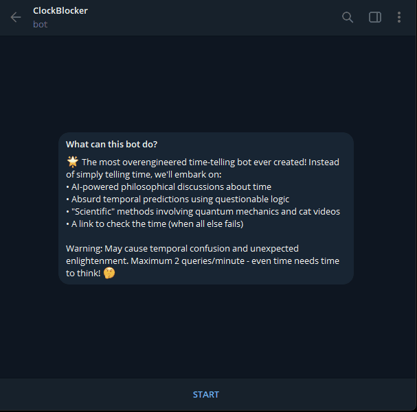

# ClockBlocker Bot 🕰️

The most unnecessarily complex time-telling Telegram bot ever created. Because why check the time normally when you can embark on a philosophical journey through space-time?




## Features

- Philosophical musings on the nature of time
- Wildly inaccurate time predictions using AI
- Absurd time estimation methods
- A link to actually check the time (when all else fails)

## Setup

1. Create a `.env` file with your credentials:

```
TELEGRAM_TOKEN=your_telegram_bot_token
OPENROUTER_API_KEY=your_openrouter_api_key
```

2. Install dependencies:

```bash
pip install -r requirements.txt
```

3. Run the bot:

```bash
python bot.py
```

## Usage

Just send `/time` to the bot and prepare for an existential crisis about the nature of time itself.

## Warning

This bot is intentionally overengineered and should not be used for any serious time-telling purposes. Side effects may include temporal confusion, philosophical enlightenment, and mild amusement.
